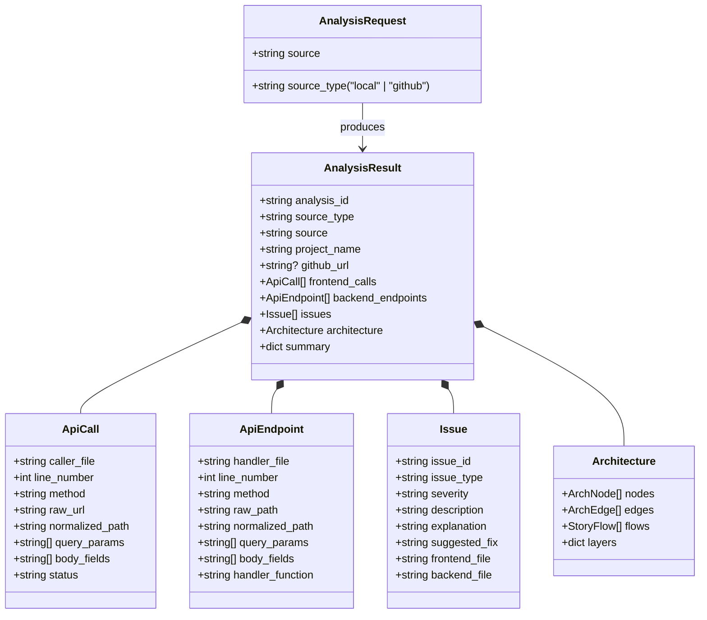

# BARA — Backend Architecture & Relationship Analyzer

> **Deterministic Frontend ↔ Backend Contract Analyzer, Relationship Mapper, and Visual Flow Storyteller.**

BARA statically inspects your entire application codebase to discover how frontend components, API clients, backend routes, services, and databases fit together. It detects contract mismatches (broken paths, method conflicts, missing body fields, undeclared query parameters) and animates the complete request lifecycle across your multi-tier architecture without executing untrusted code.

---

## 📑 Table of Contents

- [⚡ Key Highlights](#-key-highlights)
- [🏗️ System Architecture](#️-system-architecture)
  - [Architecture Pipeline Diagram](#architecture-pipeline-diagram)
  - [Data Model & Flow](#data-model--flow)
  - [5-Tier Multi-Layer Visual Model](#5-tier-multi-layer-visual-model)
  - [UI Component Hierarchy](#ui-component-hierarchy)
- [🔬 How BARA is Made (Internal Engineering)](#-how-bara-is-made-internal-engineering)
  - [1. Source Manager & Workspace Isolation](#1-source-manager--workspace-isolation)
  - [2. Scanner & Framework Detection](#2-scanner--framework-detection)
  - [3. Prefix & Environment Resolution](#3-prefix--environment-resolution)
  - [4. Frontend Static Analysis Engine](#4-frontend-static-analysis-engine)
  - [5. Backend Static Analysis Engine](#5-backend-static-analysis-engine)
  - [6. Contract Mismatch Detection Algorithm](#6-contract-mismatch-detection-algorithm)
  - [7. Interactive Canvas & Animation Engine](#7-interactive-canvas--animation-engine)
- [🚀 Guidelines to Run BARA](#-guidelines-to-run-bara)
  - [Prerequisites](#prerequisites)
  - [Step 1: Clone or Open the Repository](#step-1-clone-or-open-the-repository)
  - [Step 2: Backend Setup & Execution](#step-2-backend-setup--execution)
  - [Step 3: Frontend Setup & Execution](#step-3-frontend-setup--execution)
- [🧪 Running the Verification Test Suites](#-running-the-verification-test-suites)
  - [Backend Pytest Suite (90 tests)](#backend-pytest-suite-90-tests)
  - [Frontend Vitest Suite (28 tests)](#frontend-vitest-suite-28-tests)
  - [Production Build Verification](#production-build-verification)
- [📖 User Guidelines: How to Use BARA](#-user-guidelines-how-to-use-bara)
  - [Option A: Analyzing a Local Project Folder](#option-a-analyzing-a-local-project-folder)
  - [Option B: Analyzing a Public GitHub Repository](#option-b-analyzing-a-public-github-repository)
  - [Exploring the 7 Analysis Views](#exploring-the-7-analysis-views)
  - [Using the Request Flow Animator & Controls](#using-the-request-flow-animator--controls)
- [🔒 Security & Determinism](#-security--determinism)
- [📄 License](#-license)

---

## ⚡ Key Highlights

- **📁 Native Local Folder Picker**: No manual path typing. Select any local project directory directly using your native operating system folder dialog (`<input type="file" webkitdirectory>`).
- **🐙 Any Public GitHub Repository**: Analyze any public GitHub repository (`https://github.com/<owner>/<repo>`) with automatic shallow-cloning and safe sandbox cleanup.
- **⚡ Unified Deterministic Analysis Engine**: Identical analysis pipeline for both local folders and GitHub repositories — zero duplicated logic, zero hardcoded project paths, and zero demo data assumptions.
- **📖 Story-Driven Architecture Flow**: 5-stage animated request storyteller (`Frontend UI` ➔ `API Client` ➔ `Backend Route` ➔ `Service Controller` ➔ `Database / External` ➔ `Response Return`) with camera tracking, active node centering, contextual zoom, and playback controls.
- **⚠️ Contract Mismatch Detection**: Pinpoints broken integration points with plain-English explanations, side-by-side location diffs, and concrete suggested code fixes.
- **🌐 Broad Framework & Protocol Coverage**:
  - **Frontend**: React, React Router, Next.js, Vue, Angular, Svelte, plain TS/JS (`fetch`, `axios`, `ky`, `got`, `React Query`, `SWR`, `WebSocket`, `Socket.IO`, `GraphQL`).
  - **Backend**: FastAPI, Flask, Django, Express, NestJS, Spring Boot, Gin, Laravel.
  - **Databases & ORMs**: Prisma, SQLAlchemy, Mongoose, TypeORM, Sequelize, Hibernate, GORM, PostgreSQL, MySQL, MongoDB, SQLite, Redis.
- **📊 7 Dedicated Analysis Views**:
  1. **Issues**: High, medium, and low severity contract mismatches with code fixes.
  2. **Architecture**: Dual-mode interactive canvas (`Request Flow` + `Architecture Overview`).
  3. **Frontend**: Client instances, base URLs, callers, query parameters, and code snippets.
  4. **Backend**: Routes, HTTP methods, controllers, request/response models, and evidence.
  5. **API Connections**: Unified matrix showing matched, mismatched, unused, and external endpoints.
  6. **Database / Services**: Detected ORMs, database engines, and third-party integrations (Stripe, OpenAI, etc.).
  7. **Repository Structure**: Real hierarchical directory tree with architectural role badges.

---

## 🏗️ System Architecture

BARA is built as a **decoupled, multi-tier full-stack application**. The backend provides deterministic static analysis services via a REST API, and the frontend renders an interactive, animated visual exploration workspace.

### Architecture Pipeline Diagram

```
                           ┌───────────────────────────┐
                           │   BARA Web Interface UI   │
                           │     (React 19 + Vite)     │
                           └─────────────┬─────────────┘
                                         │
                   ┌─────────────────────┴─────────────────────┐
                   │                                           │
         📁 Browser Folder Picker                     🐙 GitHub HTTPS URL
         (webkitdirectory files)                               │
                   │                                           │
                   ▼                                           ▼
         POST /api/analyze/upload                      POST /api/analyze
                   │                                           │
                   └─────────────────────┬─────────────────────┘
                                         ▼
                           ┌───────────────────────────┐
                           │      Source Manager       │
                           │    (source_manager.py)    │
                           │  - Path Traversal Guards  │
                           │  - Isolated Workspace     │
                           └─────────────┬─────────────┘
                                         ▼
                          ResolvedSource (project_path)
                                         │
                                         ▼
       ══════════════════ UNIFIED ANALYSIS PIPELINE ══════════════════
                                         │
                      1. Scanner (scanner.py)
                         Detects frameworks, files, categories
                                         │
                      2. Resolvers
                         ├─ RoutePrefixResolver (prefix_resolver.py)
                         └─ EnvResolver (env_resolver.py)
                                         │
                      3. Analyzers
                         ├─ Frontend Analyzer (frontend_analyzer.py)
                         └─ Backend Analyzer (backend_analyzer.py)
                                         │
                      4. Mismatch Detector (mismatch_detector.py)
                         Path, Method, Field, Query Mismatches
                                         │
                      5. Multi-Tier Architecture Builder (architecture_builder.py)
                         Nodes, Directed Edges, Story Flow Steps
                                         │
                      6. Workspace Cleanup (cleanup())
                         Safe deletion of temporary workspaces
       ═══════════════════════════════════════════════════════════════
                                         │
                                         ▼
                                   AnalysisResult
                                         │
                                         ▼
                           ┌───────────────────────────┐
                           │    Interactive Results    │
                           │  7 Views + Flow Animation │
                           └───────────────────────────┘
```

### Data Model & Flow



### 5-Tier Multi-Layer Visual Model

The architectural canvas organizes detected elements into five distinct horizontal strata:

1. **Tier 1: Frontend Presentation (`frontend`)**: Client-side view components, pages, templates, and buttons that initiate user interactions.
2. **Tier 2: API Client (`api_call`)**: HTTP abstractions, API client wrappers, fetch routines, and Axios configurations.
3. **Tier 3: Backend Ingress (`backend_route`)**: Web framework routing decorators, route handlers, and URL controllers.
4. **Tier 4: Business Logic (`service`)**: Controller classes, service layers, and business processing routines.
5. **Tier 5: Data & Infrastructure (`database` / `external`)**: Database schemas, ORM models, tables, and external third-party APIs (e.g. Stripe, AWS S3, OpenAI).

### UI Component Hierarchy

```
App.tsx
├── ErrorBoundary
├── Navigation Header
└── Router Switch
    ├── HomePage.tsx
    │   ├── Tab: Local Project (HTML5 Folder Picker)
    │   ├── Tab: GitHub Repository (URL Input + Shallow Clone)
    │   └── Quick Start Sample Buttons
    └── ResultsPage.tsx
        ├── Project Summary Banner
        ├── 7 View Navigation Bar
        │   ├── Tab 1: Issues View (IssueList.tsx, IssueDetail.tsx)
        │   ├── Tab 2: Architecture View (ArchitectureDiagram.tsx)
        │   │   ├── Mode: Request Flow (Story Player + 5-Tier Animated Canvas)
        │   │   ├── Mode: Architecture Overview (Component Filter + Multi-Tier Graph)
        │   │   ├── Flow Selector Sidebar
        │   │   ├── Playback Controls Bar
        │   │   ├── Node Details Drawer (7 Core Questions)
        │   │   └── Edge Details Drawer (Contract Evidence)
        │   ├── Tab 3: Frontend View (API Client Table + Query Params + Code)
        │   ├── Tab 4: Backend View (Route Table + Methods + Handlers + Models)
        │   ├── Tab 5: API Connections (Unified Contract Matrix)
        │   ├── Tab 6: Database / Services (ORMs, Databases, External APIs)
        │   └── Tab 7: Repository Structure (RepositoryStructureView.tsx)
        └── Footer & Status Bar
```

---

## 🔬 How BARA is Made (Internal Engineering)

### 1. Source Manager & Workspace Isolation

Located in `backend/app/services/source_manager.py`:
- **Folder Uploads**: Receives multipart file uploads with preserved relative directory paths. Files are safely reconstituted inside an isolated temporary directory created via Python's `tempfile.mkdtemp(prefix="bara_upload_")`.
- **Directory Traversal Protection**: Every incoming file path is inspected against path traversal vulnerabilities (blocking `..`, leading slashes, null bytes, and non-canonical filesystem escapes).
- **GitHub Shallow Clones**: Validates the public GitHub HTTPS format via regex (`^https://github\.com/[A-Za-z0-9_.\-]+/[A-Za-z0-9_.\-]+(\.git)?/?$`) and executes a sandboxed shallow clone:
  ```bash
  git clone --depth 1 --single-branch <url> <temp_dir>/repo
  ```
- **Guaranteed Cleanup**: Every resolved source is assigned a cleanup handler executed within a Python `finally` block, ensuring no lingering clones or temp directories consume disk space.

### 2. Scanner & Framework Detection

Located in `backend/app/analyzers/scanner.py`:
- Traverses the filesystem ignoring heavy directories (`node_modules`, `.git`, `dist`, `__pycache__`, `.venv`, `.cargo`, `vendor`).
- Classifies files into architectural roles: `frontend`, `backend`, `database`, `config`, `documentation`.
- Identifies active frameworks:
  - Frontend: React, Next.js, Vue, Angular, Svelte.
  - Backend: FastAPI, Flask, Django, Express, NestJS, Spring Boot, Gin, Laravel.
  - Databases/ORMs: Prisma, SQLAlchemy, Mongoose, TypeORM, Sequelize, Hibernate, GORM.

### 3. Prefix & Environment Resolution

- **Route Prefix Resolver (`backend/app/analyzers/prefix_resolver.py`)**:
  Resolves nested and prefixed route hierarchies across complex backend apps:
  - FastAPI: `app.include_router(router, prefix="/api/v1")`
  - Express: `app.use("/api/v1", router)`
  - Flask: `Blueprint("auth", __name__, url_prefix="/auth")`
  - NestJS: `@Controller("api/v1/users")`
  - Spring Boot: `@RequestMapping("/api/v1")`
- **Environment Resolver (`backend/app/analyzers/env_resolver.py`)**:
  Parses configuration files (`.env*`, `vite.config.ts`, `next.config.js`) and client instantiations (`axios.create({ baseURL: process.env.API_URL })`) to resolve relative API paths to their full base URLs.

### 4. Frontend Static Analysis Engine

Located in `backend/app/analyzers/frontend_analyzer.py`:
- Static AST and lexical analysis across JavaScript and TypeScript files.
- Detects API calls created with:
  - Browser native `fetch(...)`
  - Axios (`axios.get`, `axios.post`, `axios(config)`)
  - Modern clients: `ky`, `got`, `@tanstack/react-query`, `useSWR`, `superagent`
  - Realtime & RPC: `WebSocket`, `Socket.IO`, `GraphQL` queries
- Extracts HTTP methods, URLs, path parameters, query string parameters, and payload body fields.

### 5. Backend Static Analysis Engine

Located in `backend/app/analyzers/backend_analyzer.py`:
- Employs Python's built-in `ast` module for Python backends (FastAPI, Flask, Django) and high-fidelity regex parsers for JavaScript, TypeScript, Go, Java, and PHP backends.
- Extracts endpoint paths, allowed HTTP methods (`GET`, `POST`, `PUT`, `DELETE`, `PATCH`), controller function names, source code line numbers, Pydantic/DTO request body schemas, and response models.

### 6. Contract Mismatch Detection Algorithm

Located in `backend/app/analyzers/mismatch_detector.py`:
- Normalizes path structures into tokenized parameters (e.g. `/users/:id` ↔ `/users/{id}`).
- Executes exact and fuzzy path-matching:
  - `MATCHED`: Both path and method align seamlessly.
  - `METHOD_MISMATCH`: Frontend requests a path with an HTTP method the backend endpoint does not allow (e.g. `GET /api/items` vs `POST /api/items`).
  - `PATH_MISMATCH`: Frontend requests a path that differs slightly (typo or casing difference) from a closely matching backend endpoint.
  - `REQUEST_FIELD_MISMATCH`: Frontend payload sends keys not defined in the backend endpoint's request model.
  - `QUERY_PARAM_MISMATCH`: Frontend appends query parameters not accepted or documented by the backend route.
  - `MISSING_BACKEND_ENDPOINT`: Frontend sends a request to an endpoint that does not exist anywhere in the backend codebase.

### 7. Interactive Canvas & Animation Engine

Located in `frontend/src/components/ArchitectureDiagram.tsx`:
- **Dual Visual Modes**:
  1. **Request Flow**: Linear sequential storytelling highlighting request progression through the 5 tiers.
  2. **Architecture Overview**: Spatial multi-tier graph showing all components, connections, and service dependencies simultaneously.
- **Physics & Camera Projection**: Smooth pan and zoom camera with bounding-box centering, `Fit to Screen`, and `Reset` controls.
- **Dynamic Request Storyteller**: Synthesizes a human-readable, plain-English narrative of how data traverses the application for each selected endpoint flow.

---

## 🚀 Guidelines to Run BARA

### Prerequisites

Ensure you have the following installed on your machine:
- **Python**: Version 3.10 or higher (`python3 --version`)
- **Node.js**: Version 18.0 or higher (`node --version`)
- **Git**: Installed and accessible in your shell (`git --version`)

---

### Step 1: Clone or Open the Repository

```bash
git clone https://github.com/your-username/BARA.git
cd BARA
```

---

### Step 2: Backend Setup & Execution

1. Open a terminal and navigate to `backend/`:
   ```bash
   cd backend
   ```

2. Create and activate a Python virtual environment:
   ```bash
   python3 -m venv .venv
   source .venv/bin/activate
   ```
   *(On Windows Command Prompt: `.venv\Scripts\activate`)*
   *(On Windows PowerShell: `.venv\Scripts\Activate.ps1`)*

3. Install required Python packages:
   ```bash
   pip install -r requirements.txt
   ```

4. Launch the FastAPI server:
   ```bash
   uvicorn app.main:app --host 0.0.0.0 --port 8000 --reload
   ```

5. Verify that the backend is running:
   ```bash
   curl http://localhost:8000/health
   # Expected response: {"status":"ok","service":"BARA"}
   ```

---

### Step 3: Frontend Setup & Execution

1. Open a second terminal window and navigate to `frontend/`:
   ```bash
   cd frontend
   ```

2. Install Node.js dependencies:
   ```bash
   npm install
   ```

3. Start the Vite development server:
   ```bash
   npm run dev
   ```

4. Open your web browser and navigate to:
   ```
   http://localhost:5173
   ```

---

## 🧪 Running the Verification Test Suites

BARA includes automated test suites covering both the analysis pipeline and the frontend visualization layer.

### Backend Pytest Suite (90 tests)

```bash
cd backend
source .venv/bin/activate
pytest
```
*Validates:*
- Scanner file classification across all frameworks
- Prefix resolution across nested routers
- Environment variable and base URL normalizers
- AST-level frontend and backend route extraction
- Contract mismatch detection across 6 failure modes
- Uploaded folder packaging & GitHub shallow-clone workflows
- 16 real-world project archetypes

### Frontend Vitest Suite (28 tests)

```bash
cd frontend
npm test
```
*Validates:*
- HTML5 folder picker interaction & directory structure preservation
- GitHub URL input validation & cloning workflow
- Error boundary fallbacks & error handling
- Architecture diagram multi-tier rendering & layer toggling
- Flow player controls, speed adjustments, and step navigation

### Production Build Verification

```bash
cd frontend
npm run build
```
*Validates that all TypeScript types compile cleanly and Vite produces production-ready static assets.*

---

## 📖 User Guidelines: How to Use BARA

### Option A: Analyzing a Local Project Folder

1. Open the BARA web interface at `http://localhost:5173`.
2. Ensure the **📁 Local Project** tab is selected on the home screen.
3. Click the **📁 Add Local Folder** button.
4. In your operating system's native folder picker, select the root directory of the application you wish to analyze.
5. BARA displays the selected folder name, total file count, and size.
6. Click **[ Analyze → ]**. BARA will upload the source files, analyze the contracts, and open the results dashboard.

### Option B: Analyzing a Public GitHub Repository

1. Open the BARA web interface at `http://localhost:5173`.
2. Click the **🐙 GitHub Repository** tab on the home screen.
3. Enter any public repository URL, for example:
   - `https://github.com/tiangolo/full-stack-fastapi-template`
   - `https://github.com/fastapi/fastapi`
   - `https://github.com/pallets/flask`
   - `https://github.com/expressjs/express`
4. Click **[ Clone & Analyze → ]**. BARA will shallow-clone the repository into an isolated sandbox, execute the analysis, clean up the workspace, and display the results.

### Exploring the 7 Analysis Views

Once analysis completes, navigate through the 7 top-level tabs:

- **1. ⚠️ Issues**: Inspect all detected contract mismatches. Each card provides a description, explanation, severity indicator, and side-by-side frontend vs backend code diffs with suggested fixes.
- **2. 🏛️ Architecture**:
  - **Request Flow**: An interactive step-by-step player showing request and response packets traversing across the 5 architectural layers.
  - **Architecture Overview**: A holistic graph of all discovered frontend components, endpoints, controllers, and databases.
  - **Filters**: Quickly filter visible nodes by `All Components`, `Issues`, `Frontend`, or `Backend`.
  - **Inspectors**: Click any node or edge to open the Details Drawer answering:
    - *What is this?*
    - *Where is it located?*
    - *What does it do?*
    - *What calls it / What does it call?*
    - *Are there contract issues?*
- **3. 🖥️ Frontend**: A comprehensive list of all discovered client calls, HTTP methods, target URLs, and parameter schemas.
- **4. ⚙️ Backend**: Complete list of discovered backend routes, controllers, HTTP methods, and data models.
- **5. 🔗 API Connections**: A unified contract matrix comparing frontend calls against backend endpoints, classifying them as Matched, Mismatched, or Unused.
- **6. 🗄️ Database / Services**: All detected database models, ORMs (Prisma, SQLAlchemy, Mongoose), and third-party API clients.
- **7. 📂 Repository Structure**: The authentic project directory tree annotated with architectural role tags.

### Using the Request Flow Animator & Controls

In the **Architecture** view under **Request Flow** mode:
- **Left Sidebar**: Select any detected API flow from the list or use the search box to find a specific endpoint.
- **▶ Play / ⏸ Pause**: Start or pause the packet animation.
- **↺ Replay**: Reset the request packet to the frontend caller and restart playback.
- **⏮ Prev / ⏭ Next**: Step manually through individual request hops.
- **Speed Selector (`0.5x`, `1x`, `2x`)**: Adjust animation playback speed.
- **Step Bullets (`● ━ ● ━ ○`)**: Click directly on any step indicator to jump to that stage of the request lifecycle.
- **Camera Controls**:
  - `Fit to Screen`: Re-centers and scales the canvas to fit all visible nodes.
  - `Reset View`: Returns zoom and pan to the default perspective.
  - Pan by dragging the canvas; zoom using the mouse wheel or trackpad.

---

## 🔒 Security & Determinism

- **Zero Arbitrary Code Execution**: BARA is strictly a static analyzer. It parses code as text and Abstract Syntax Trees. It **never** runs or imports analyzed code.
- **Isolated Sandboxes**: GitHub clones and local file uploads are stored in isolated temporary directories created with restricted filesystem permissions.
- **Path Traversal Protection**: All user-provided paths and file trees are strictly checked against directory traversal patterns (`..`, `/`, `\`, null bytes).
- **Post-Analysis Cleanup**: Cloned repositories and uploaded files are deleted immediately after analysis completes.

---

## 📄 License

This project is open-source and licensed under the [MIT License](LICENSE).
